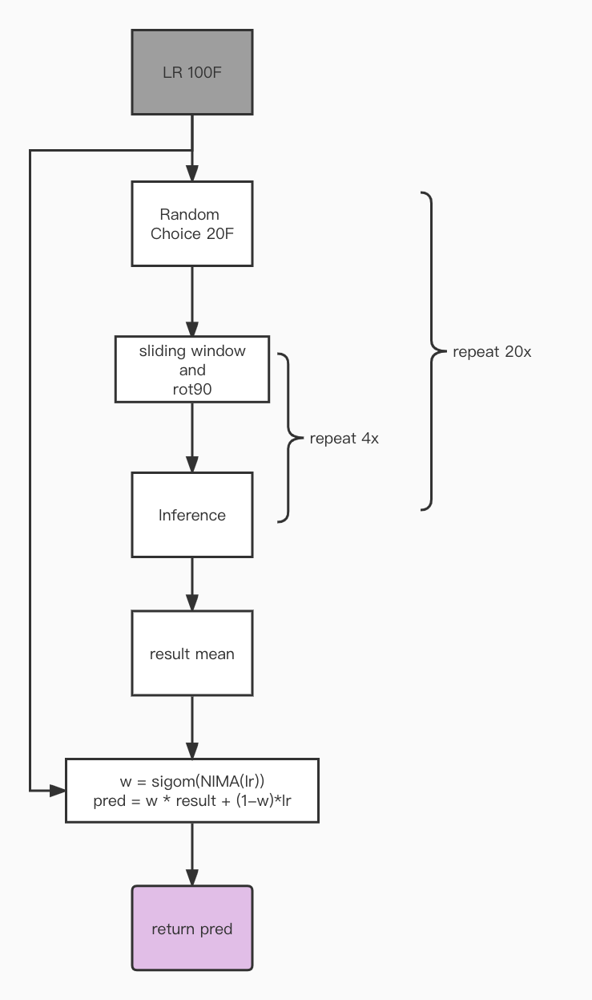

## Methodology

As illustrated in Figure, our pipeline mainly consists of a image preocess module, Restormer<sup>[4]</sup> and a NIMA<sup>[5]</sup> module. In the inference stage, we randomly select 20 images from the 100 low-resolution images each time for a total of 20 times. 

### Processing
A sliding window processing <sup>[10]</sup> and a rotation processing are done on the randomly selected images. 

### Inference
Restormer takes the preocessed images as input and output a high resolution image. 

## Ground Truth Data
- scene data
    + CTW<sup>[1]</sup>
    + DIV2K<sup>[2]</sup>
    + Total-text<sup>[3]</sup>

- text data
    + synthetic data by program
    + 手机拍照收集的数据


## The simulator  
- parameter configuration
```python
import random
kwargs = dict(
                L=random.randint(200, 400),
                D=random.uniform(0.06143, 0.091254),
                Cn2=random.uniform(5.7386e-14, 9.7386e-14),
                corr=random.choice(np.arange(-1, -.00, 0.01)).__round__(3),
            )   
```

## Model
Our main method consists of transformer and image quality assessment(IQA):
+ overall pipeline：

+ Restormer<sup>[4]</sup>：这是CVPR2022上的一篇图像修复文章，它在去雨、去雾、超分和去模糊四个方向上都取得了SOTA的成绩。正如它本文描述的一样，它采用了基于transformer的渐进式模型结构。我们采用了restormer的基础架构，并在上面微调了自己模型，但是模型模型仅仅是在单张图像上进行修复任务。我们修改了模型的输入和输出为多张图片的输入单张图像输出的模块。另外，我们对大气扰动任务进行分析，获取的图像中，帧与帧之间在时序上关联并不是很密切，但是在空间上的关系确实很大，我们采用从100帧中随机抽取20帧送入网络的策略从而提取帧之间的空间关系。从大量的实验中证明这种做法是有效的。
+ Restormer<sup>[4]</sup>： This is an image restoration paper at CVPR2022 that achieves SOTA in four tasks:  dahazing, deraining, super resolution, and deblurring. As it is described in this paper, it uses a progressive model structure based on the transformer.  We adopted the restormer infrastructure and finetuned our model. We modified the input of the model to be multiple images. In addition, we analyze the atmospheric turbulence mitigation task. The frames are not very closely related to each other in terms of timing, but they are highly related in terms of space. We use a strategy of randomly selecting 20 frames from 100 frames and feeding them into the network to extract the spatial relationships between frames. This approach has been shown to be effective in a large number of experiments.
+ NIMA<sup>[5]</sup>：图像质量评估（IQA）在图像修复中有着重要的地位，通过有参考和无参考的图像评估方法，我们对于模型的好坏会有大致的判断，google在2018年提出了NIMA一种无参考图像质量评估方法。我们采用NIMA对输入信息进行打分，并和识别结果进行加权，这相对于我们手动的设置权重获取了更高的精度，识别精度和PSNR也从89.6和22.3到94和24.8.
+ NIMA<sup>[5]</sup>:  Image quality assessment (IQA) has an important position in image restoration. The goodness of the model can be evaluated by reference and non-reference image assessment methods. We used NIMA, a non-reference image quality assessment method proposed by Google in 2018, to score the input information and weight it with the reconstructed image. Compared to our manual setting of weights, the recognition accuracy improves from 89.6 to 94 and the psnr improves from 22.3 to 24.8.
+ 训练过程：我们借鉴了restormer的训练策略，采用adam优化器，学习率从1e-4通过循环余弦退火的方式到1e-10
+ Training process: We borrowed the training strategy of *Restormer*, using the adam optimizer, and the learning rate was changed from 1e-4 to 1e-10 by CosineAnnealingWarmRestarts of Pytorch.
+ 训练数据上：我们设计两部分的实验数据，第一部分数据，包含大量的文本图像和少量的图像数据，第二部分包含相同比例的文本图像和场景图像。在训练中我们优先训练第一部分的数据，大概一周左右，再在第一部分数据的基础上将第二部分的数据送给模型，训练得到最好的结果大概2-3周时间。这样可以平衡我们的方法在文本和场景数据上的表现。
+ Training data: We design two parts of experimental data, the first part of the data contains a large number of text images and a small amount of image data, and the second part contains the same proportion of text images and scene images. In the training, we first train the first part of the data for about a week, and then send the second part of the data to the model on the basis of the first part of the data. This balances the performance of our method on textual and scene data.
+ 损失函数上：我们设计了大量的loss函数，比如傅里叶loss，感知损失等，但是其中大部分都是不能引导模型获得比较好的恢复效果。最终参考restormer我们使用了L1 loss，但是额外的使用了ssim loss作为辅助loss。
+ 噪声上：我们通过合成器论文^{[6、7、8]}$和$cycleISP^{[9]}$以及图像过程的整体思考，发现其中不仅仅包含大气干扰一种噪声，如果不考虑其他的噪声，比如高斯噪声、高斯模糊等其他噪声，直接合成数据进行训练，很难得到很好的效果。并且其他的噪声，比如光照、图像质量等，如果也加入到合成的过程中，我们会得到更好的结果。
+ On the noise: We use the synthesizer paper<sup>[6, 7, 8]</sup> and cycleISP<sup>[9]</sup> to think about the overall image imaging process, and find that it contains more than just atmospheric turbulence. Without considering other noises, such as Gaussian noise, Gaussian blur and other noises, it is difficult to obtain good results by directly synthesizing data for training. In the end we added other noises, such as Gaussian noise, Gaussian blur, lighting and etc., into the synthesis process, and we got a better result compared to just atmospheric turbulence noise.
+ 划窗策略<sup>[10]</sup>：我们参考并改进了划窗的策略，结合100帧的信息并都进行推理，并进行集成，这样不仅仅利用了空间上的信息也对所有的帧信息都进行了利用。我们在识别精确度和PSNR上都有更高的结果。
+ Sliding window strategy<sup>[10]</sup>: We refer to and improve the windowing strategy, combine the information of 100 frames and conduct inference, and finally integrate it, which not only uses the spatial information but also all frame information. have been used. We have higher results in both recognition accuracy and PSNR.

## Download ours data
- We are preparing to upload the link, please contact us in time if necessary.

## Reference,
[1] [A Large Chinese Text Dataset in the Wild](https://ctwdataset.github.io/)

[2] [NTIRE 2017 Challenge on Single Image Super-Resolution: Dataset and Study](https://data.vision.ee.ethz.ch/cvl/DIV2K/)

[3] [Total-Text: Towards Orientation Robustness in Scene Text Detection](https://github.com/cs-chan/Total-Text-Dataset)

[4] [Restormer: Efficient Transformer for High-Resolution Image Restoration](https://arxiv.org/abs/2111.09881)

[5] [NIMA: Neural Image Assessment](https://arxiv.org/abs/1709.05424)

[6] [Turbulence Simulator v2: Phase-to-space transform](https://engineering.purdue.edu/ChanGroup/project_turbulence.html)

[7] [Turbulence Simulator v1: Multi-aperture simulator](https://engineering.purdue.edu/ChanGroup/project_turbulence.html)

[8] [Turbulence Reconstruction](https://engineering.purdue.edu/ChanGroup/project_turbulence.html)

[9] [CycleISP: Real Image Restoration via Improved Data Synthesis](https://arxiv.org/abs/2003.07761)

[10] [Revisiting Global Statistics Aggregation for Improving Image Restoration](https://arxiv.org/pdf/2112.04491.pdf)

[11] [Simple Baselines for Image Restoration](https://arxiv.org/abs/2204.04676)
