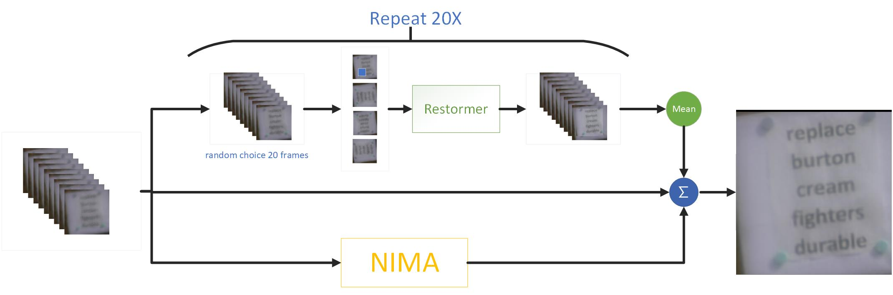
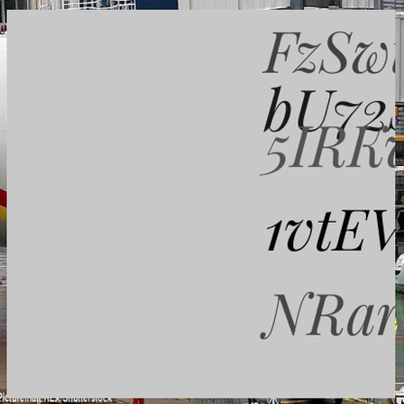
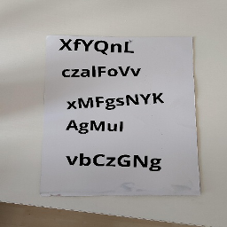

## Methodology

As illustrated in Figure, our pipeline mainly consists of a image preocess module, Restormer<sup>[4]</sup> and a NIMA<sup>[5]</sup> module. In the inference stage, we randomly select a total of 20 batches of images from the 100 low-resolution images and each batch contains of 20 images. 

### Preprocessing
A sliding window processing<sup>[10]</sup> and a rotation processing are done on each batch images. The sliding window size is 128 x 128 and the stride is 32. The rotaion angle are set to 0<sup>o</sup>, 90<sup>o</sup>, 180<sup>o</sup> and 270<sup>o</sup>, respectively.

### Inference
Restormer takes the preocessed images as input and output a high resolution image. Since each batch of images is processed 4 times, a total of 4 high-resolution images are obtained. Therefore, a total of 80 high-resolution images are obtained after 20 rounds of inference. The average of these 80 images is used as the reconstructed image. Drawing on the residual design, we used NIMA<sup>[5]</sup>, a non-reference image quality assessment method, to score the input information and weight it with the reconstructed image and the weighted reconstructed image is used as the final output.


## The simulator configuration
- parameter configuration
```python
import random
kwargs = dict(
                L=random.randint(200, 400),
                D=random.uniform(0.06143, 0.091254),
                Cn2=random.uniform(5.7386e-14, 9.7386e-14),
                corr=random.choice(np.arange(-1, -.00, 0.01)).__round__(3),
            )   
```

## Ground Truth Data
- scene data
    + CTW<sup>[1]</sup>
    + DIV2K<sup>[2]</sup>
    + Total-text<sup>[3]</sup>

- text data
    + synthetic data by program

    
    


- External Data
    - We didn't use external data 
- Download ours data
    - We are preparing to upload the link, please contact us in time if necessary.

## Model
Our main method consists of transformer and image quality assessment(IQA):
+ Restormer<sup>[4]</sup>： This is an image restoration paper at CVPR2022 that achieves SOTA in four tasks:  dahazing, deraining, super resolution, and deblurring. As it is described in this paper, it uses a progressive model structure based on the transformer.  We adopted the restormer infrastructure and finetuned our model. We modified the input of the model to be multiple images. In addition, we analyze the atmospheric turbulence mitigation task. The frames are highly related in terms of space.
We use a strategy of randomly selecting 20 frames from 100 frames and feeding them into the network to extract the spatial relationships between frames. This approach has been shown to be effective in a large number of experiments.
+ NIMA<sup>[5]</sup>:  Image quality assessment (IQA) has an important position in image restoration. The goodness of the model can be evaluated by reference and non-reference image assessment methods. We used NIMA, a non-reference image quality assessment method proposed by Google in 2018, to score the input information and weight it with the reconstructed image. Compared to our manual setting of weights, the recognition accuracy improves from 89.6 to 94 and the psnr improves from 22.3 to 24.8.
+ Training process: We used the training strategy of *Restormer*, using the adam optimizer, and the learning rate was changed from 1e-4 to 1e-10 by CosineAnnealingWarmRestarts of Pytorch.
+ Training data: We design two parts of experimental data, the first part of the data contains a large number of text images and a small amount of image data, and the second part contains the same proportion of text images and scene images. In the training, we first train the first part of the data for about a week, and then send the second part of the data to the model on the basis of the first part of the data. This balances the performance of our method on textual and scene data.
+ Loss function: We have designed a large number of loss functions, such as Fourier loss, perceptual loss, etc., but most of them cannot guide the model to obtain a better recovery effect. In the final reference to the restormer, we used L1 loss, but additionally used ssim loss as an auxiliary loss.
+ On the noise: We use the synthesizer paper<sup>[6, 7, 8]</sup> and cycleISP<sup>[9]</sup> to think about the overall image imaging process, and find that it contains more than just atmospheric turbulence. Without considering other noises, such as Gaussian noise, Gaussian blur and other noises, it is difficult to obtain good results by directly synthesizing data for training. In the end we added other noises, such as Gaussian noise, Gaussian blur, lighting and etc., into the synthesis process, and we got a better result compared to just atmospheric turbulence noise.
+ Sliding window strategy<sup>[10]</sup>: We refer to and improve the windowing strategy, combine the information of 100 frames and conduct inference, and finally integrate it, which not only uses the spatial information but also all frame information. have been used. We have higher results in both recognition accuracy and PSNR.


## Reference,
[1] [A Large Chinese Text Dataset in the Wild](https://ctwdataset.github.io/)

[2] [NTIRE 2017 Challenge on Single Image Super-Resolution: Dataset and Study](https://data.vision.ee.ethz.ch/cvl/DIV2K/)

[3] [Total-Text: Towards Orientation Robustness in Scene Text Detection](https://github.com/cs-chan/Total-Text-Dataset)

[4] [Restormer: Efficient Transformer for High-Resolution Image Restoration](https://arxiv.org/abs/2111.09881)

[5] [NIMA: Neural Image Assessment](https://arxiv.org/abs/1709.05424)

[6] [Turbulence Simulator v2: Phase-to-space transform](https://engineering.purdue.edu/ChanGroup/project_turbulence.html)

[7] [Turbulence Simulator v1: Multi-aperture simulator](https://engineering.purdue.edu/ChanGroup/project_turbulence.html)

[8] [Turbulence Reconstruction](https://engineering.purdue.edu/ChanGroup/project_turbulence.html)

[9] [CycleISP: Real Image Restoration via Improved Data Synthesis](https://arxiv.org/abs/2003.07761)

[10] [Revisiting Global Statistics Aggregation for Improving Image Restoration](https://arxiv.org/pdf/2112.04491.pdf)

[11] [Simple Baselines for Image Restoration](https://arxiv.org/abs/2204.04676)
